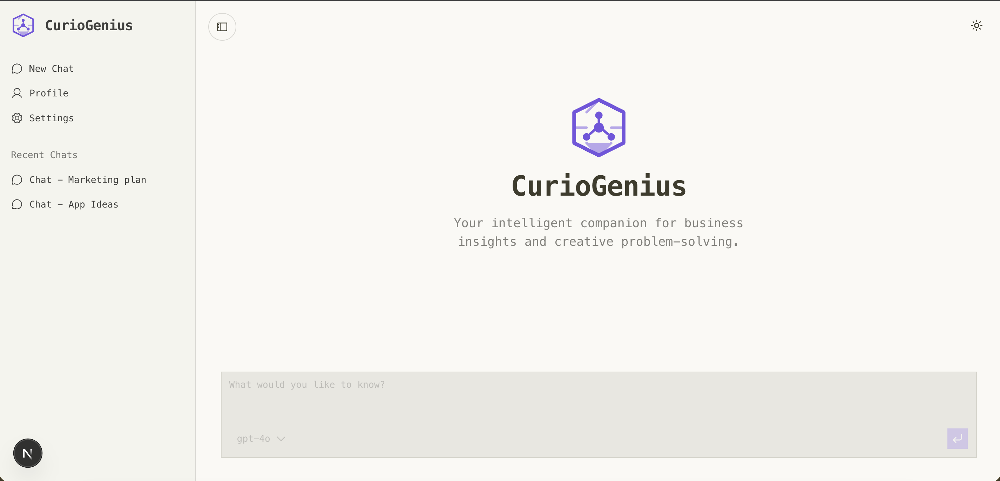

# Business Development Pod



Multi-agent business development workspace with:

- a Python backend in `server/python`
- a Next.js frontend in `client/nextjs`
- AWS integrations through `boto3` and `awscli`

## Project Structure

```text
.
├── client/nextjs    # Next.js frontend
└── server/python    # FastAPI backend and agent workflow
```

## Prerequisites

Install these tools before starting:

- Python `3.13` or later
- [`uv`](https://docs.astral.sh/uv/)
- Node.js `18+` or newer
- AWS CLI (`aws`)

Verify the tools are available:

```bash
uv --version
python3 --version
node --version
pnpm --version
aws --version
```

## AWS Setup

The backend uses AWS through `boto3`, so make sure your AWS credentials and region are configured before starting the server.

### Option 1: Configure AWS CLI
`Run this command after installing the necessary packages(shown below using uv package manager)`
```bash
aws configure
```

This will usually prompt you for:

- `AWS Access Key ID`
- `AWS Secret Access Key`
- `Default region name`
- `Default output format`

To confirm the active identity:

```bash
aws sts get-caller-identity
```

### Option 2: Use Environment Variables

If you prefer environment variables instead of `aws configure`, export them in your shell:

```bash
export AWS_ACCESS_KEY_ID="your-access-key-id"
export AWS_SECRET_ACCESS_KEY="your-secret-access-key"
export AWS_DEFAULT_REGION="your-aws-region"
```

If you use temporary credentials, also export:

```bash
export AWS_SESSION_TOKEN="your-session-token"
```

## Environment Variables

The Python backend loads variables from a `.env` file. Create one inside `server/python`.

Path:

```text
server/python/.env
```

Example:

```env
MISTRAL_API_KEY=your-mistral-api-key
AWS_ACCESS_KEY_ID=your-access-key-id
AWS_SECRET_ACCESS_KEY=your-secret-access-key
AWS_DEFAULT_REGION=your-aws-region
# Optional when using temporary AWS credentials
AWS_SESSION_TOKEN=your-session-token
```

Notes:

- `MISTRAL_API_KEY` is required by the agent model setup.
- AWS variables can come either from `.env`, exported shell variables, or your configured AWS CLI profile.

## Backend Setup With `uv`

From the project root:

```bash
cd server/python
```

Create the virtual environment:

```bash
uv venv
```

Activate it:

```bash
source .venv/bin/activate
```

Install dependencies from `pyproject.toml` and `uv.lock`:

```bash
uv sync
```

## Start the Backend Locally

After the virtual environment is activated and dependencies are installed, start the FastAPI server:

```bash
uv run python hello.py
```

The backend starts locally at:

```text
http://localhost:8080
```

## Frontend Setup

Open a new terminal from the project root and install the frontend dependencies:

```bash
cd client/nextjs
pnpm install
```

Start the frontend development server:

```bash
pnpm dev
```

The frontend runs locally at:

```text
http://localhost:3000
```

## Helpful Checks

Validate AWS access from the backend environment:

```bash
cd server/python
source .venv/bin/activate
uv run python IAM_check.py
```

## License

[MIT License](LICENSE)